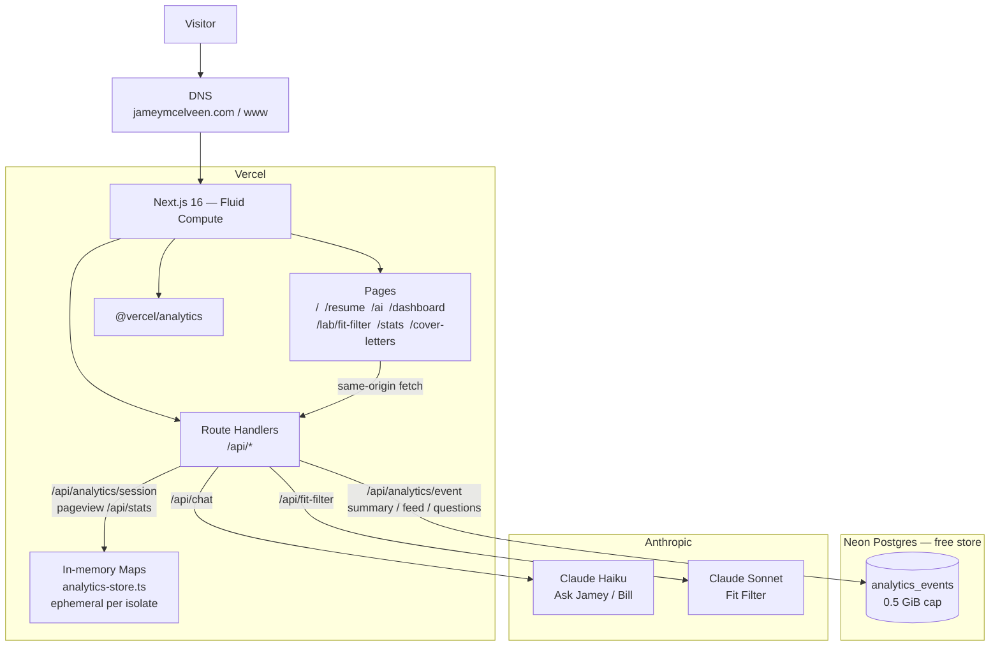
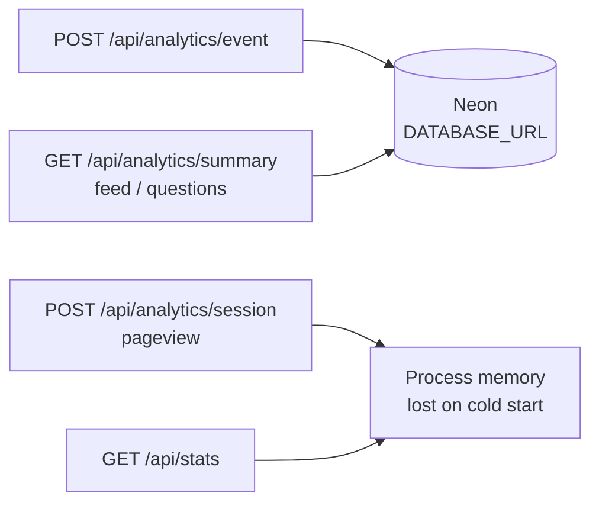

# Site architecture — jameymcelveen.com

**Last updated:** 2026-08-29

**Vercel:** yes. The live site is a Next.js 16 App Router app on Vercel (pages + Route Handlers). Apex/`www` DNS points at Vercel.

**Railway:** not in this site’s request path. There is no `backend/` service, no `/api` rewrite to Railway, and no Railway deploy workflow. Older docs (`docs/PUBLISHED_ENGINEERING_CONTEXT.md`, `scripts/hosting/`) still describe a Vercel frontend + Railway `.NET` Interview.Api split that is no longer how production works. A Railway URL on the site (`qiklog.up.railway.app`) is a **different** project, not this stack.

**Free data store:** Neon Postgres (Free: 0.5 GiB). The app already speaks Postgres over `DATABASE_URL` via `pg`. Set that env var on Vercel; without it, insight analytics (`POST /api/analytics/event` and `/dashboard`) have nothing durable to write to.

---

## Current production

Browser traffic stays on `https://jameymcelveen.com`. There is no `NEXT_PUBLIC_API_URL` and no `INTERVIEW_API_PROXY_ORIGIN` rewrite.

---

## Data: what persists and what does not

| Store | Used by | Survives deploy / cold start? |
|--------|---------|--------------------------------|
| **Neon Postgres** (`DATABASE_URL`) | Insight events, `/dashboard` | Yes. This is the free durable store. |
| **In-memory** (`analytics-store.ts`) | Legacy session/pageview/`/stats` | No. Serverless isolates are stateless. |
| **Git / `profile.json`** | Resume, home copy, static content | Yes, but it is content, not a runtime DB. |

`/api/analytics/event` returns **503** when `DATABASE_URL` is unset. Dashboard queries return empty totals in that case.

---

## Why Neon, not Railway Postgres

The code is already a `pg` `Pool` against `DATABASE_URL` (`src/lib/api/analytics-events-db.ts`). Neon is the matching free store:

- Serverless Postgres, works from Vercel Functions without a always-on box.
- Free tier **0.5 GiB** — the dashboard size bar defaults to that (`ANALYTICS_DB_LIMIT_BYTES`, default `536870912`).
- Provision from the Vercel Marketplace (`vercel integration add neon`) so `DATABASE_URL` lands on the project automatically.
- Schema: `migrations/001_analytics_events.sql` (the Railway comment at the top of that file is leftover).

Railway Postgres would work as “any Postgres,” but it would reintroduce a second host for a site that no longer runs there. Do not bring Railway back just for a database.

---

## Provision checklist (when the store is empty)

1. Link the repo: `vercel link` if needed.
2. Add Neon: `vercel integration add neon` (or Neon dashboard → copy the pooled connection string).
3. Confirm `DATABASE_URL` on Production and Preview.
4. Build already runs `scripts/run-analytics-migration.mjs` when `DATABASE_URL` is set (`pnpm build` / `pnpm db:migrate`).
5. Optional local demo rows: `pnpm run db:seed`.

Do not commit `.env` or connection strings.

---

## What is not in this diagram

- **Railway Interview.Api / SQLite volume** — retired. `next.config.ts` has no `/api` rewrite.
- **Edge runtime** — chat, fit-filter, and analytics run on Node (Fluid Compute). Do not set `runtime = 'edge'` for these routes.
- **QikLog** — separate Railway app; a link on the site, not a dependency of this deploy.
